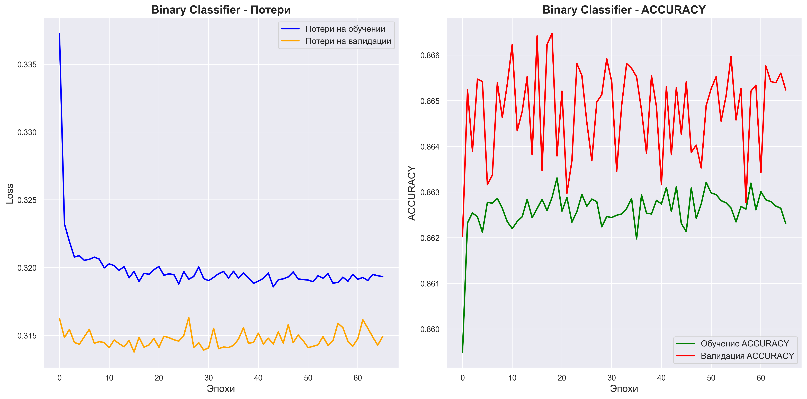
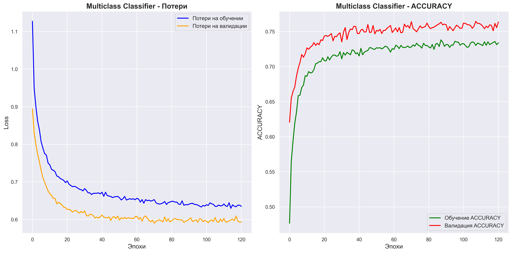
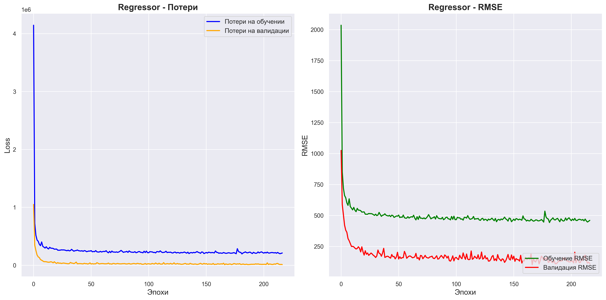
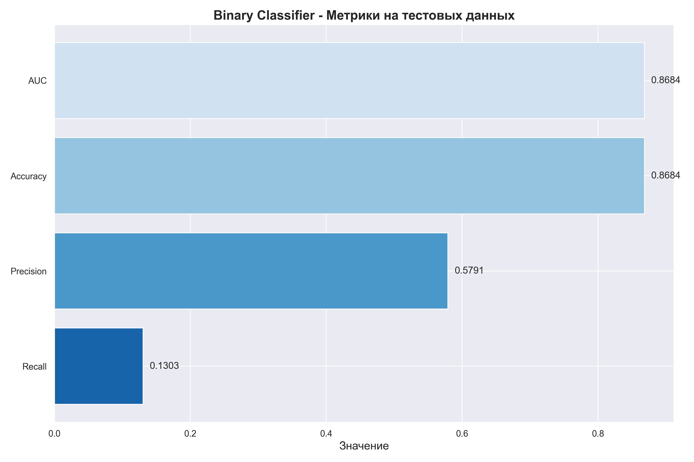
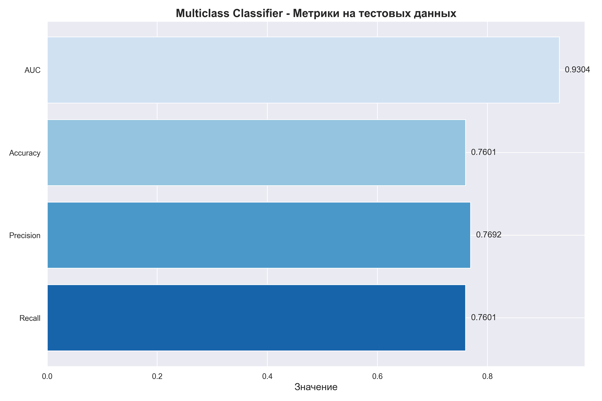
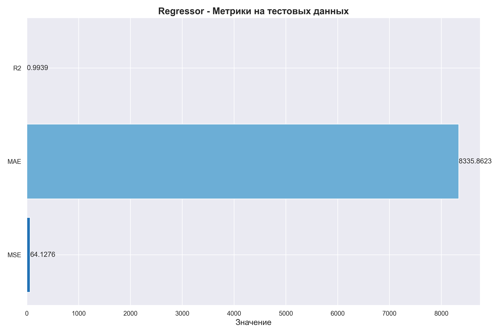
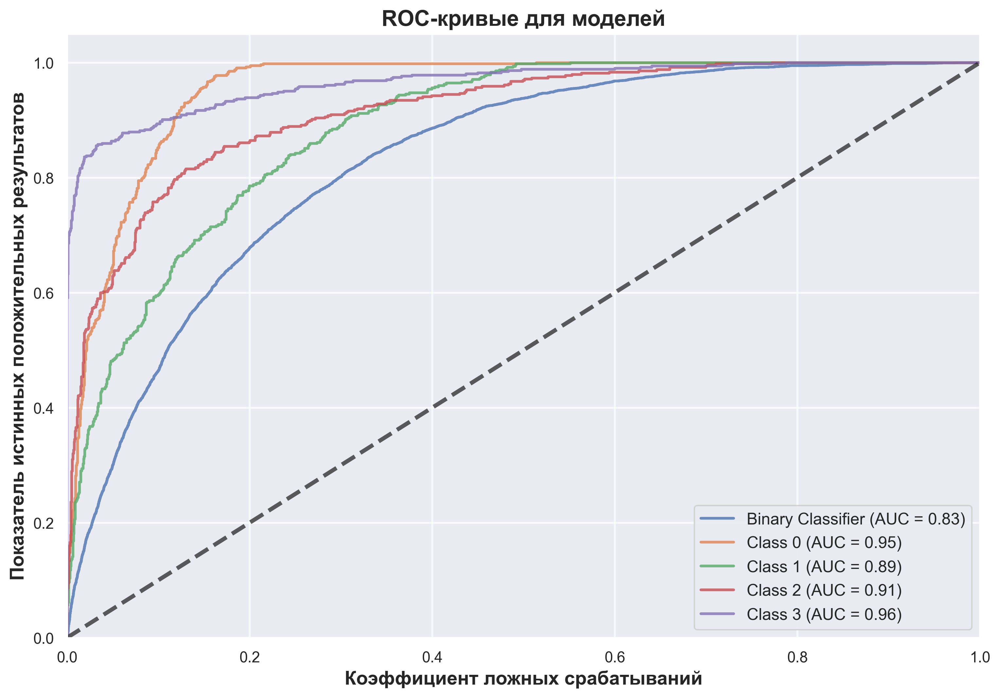

# Классификация и Регрессия с использованием нейронных сетей

Этот проект посвящён разработке и анализу моделей машинного обучения для задач бинарной и многоклассовой классификации, а также регрессии. В рамках работы были обучены и протестированы три модели, включая:
- Бинарный классификатор для прогнозирования вероятности диабета.
- Многоклассовый классификатор для оценки физического развития.
- Регрессионная модель для прогнозирования расходов домохозяйств.

## Функционал
- Предварительная обработка данных: Нормализация числовых признаков, кодирование категориальных данных.
- Разделение данных на обучающую, валидационную и тестовую выборки.
- Обучение моделей: Настройка гиперпараметров и обучение нейронных сетей.
- Оценка качества моделей: Использование метрик, таких как Recall, Precision, Weighted Accuracy, AUC, MSE, MAE, R2.
- Визуализация ROC-кривых для моделей классификации.

## Зависимости
Для работы программы необходимы следующие библиотеки:
- `numpy` и `pandas` для обработки данных.
- `scikit-learn` для построения регрессионных моделей и выполнения кросс-валидации.
- `matplotlib` для визуализации значимости признаков.
- `telegram` для разработки и работы чат-бота.

## Установка и запуск проекта
1. Клонируйте репозиторий:
```
git clone https://github.com/Sogato/NNATA-lab4.git
```
2. Создайте виртуальное окружение:
```
python -m venv env
```
3. Установите зависимости проекта:
```
pip install -r requirements.txt
```
4. Запустите программу:
```
python main.py
```

## Датасеты

### Датасет для бинарного классификатора (Diabetes Binary Classification)
**Источник:** Данные CDC BRFSS2015, предоставляющие информацию о здоровье, включая метку наличия или отсутствия диабета.
**Цель:** Оценка вероятности диагностики диабета.
**Размер выборки:** Набор данных содержит **70,692 записей**.


**Признаки:**
- **HighBP:** Наличие высокого кровяного давления.
- **HighChol:** Наличие высокого уровня холестерина.
- **CholCheck:** Прохождение проверки уровня холестерина.
- **BMI:** Индекс массы тела.
- **Smoker:** Статус курения.
- **Stroke:** Наличие инсульта.
- **HeartDiseaseorAttack:** Наличие сердечного приступа или болезни сердца.
- **PhysActivity:** Физическая активность.
- **Fruits:** Употребление фруктов.
- **Veggies:** Употребление овощей.
- **HvyAlcoholConsump:** Употребление большого количества алкоголя.
- **AnyHealthcare:** Доступ к здравоохранению.
- **NoDocbcCost:** Отказ от посещения врача из-за стоимости.
- **GenHlth:** Общий уровень здоровья.
- **MentHlth:** Количество дней плохого психического здоровья за последний месяц.
- **PhysHlth:** Количество дней плохого физического здоровья за последний месяц.
- **DiffWalk:** Трудности при ходьбе.
- **Sex:** Пол.
- **Age:** Возраст.
- **Education:** Уровень образования.
- **Income:** Уровень дохода.

**Целевой признак:**
- **Diabetes_binary:** Бинарный признак наличия или отсутствия диабета.

### Датасет для многоклассового классификатора (Body Performance Classification)
**Источник:** Данные о физическом развитии людей разного возраста.
**Цель:** Классификация уровня физического развития (A, B, C, D) на основе различных физических измерений.
**Размер выборки:** Набор данных содержит **13,393 записи**.


**Признаки:**
- **age:** Возраст.
- **gender:** Пол (закодированный как 0 и 1).
- **height_cm:** Рост (в сантиметрах).
- **weight_kg:** Вес (в килограммах).
- **body fat_%:** Процент содержания жира в теле.
- **diastolic:** Диастолическое артериальное давление.
- **systolic:** Систолическое артериальное давление.
- **gripForce:** Сила захвата.
- **sit and bend forward_cm:** Сидение и наклон вперед (в сантиметрах).
- **sit-ups counts:** Количество приседаний.
- **broad jump_cm:** Длина прыжка (в сантиметрах).

**Целевой признак:**
- **class:** Класс уровня физического развития (A, B, C, D).

### Датасет для регрессора (Household Expenses Regression)
**Источник:**  Данные предоставлены в рамках публичного набора данных за 2019 год, содержащего информацию о потреблении ресурсов и расходах домохозяйств в США. 
**Цель:** Прогнозирование общих расходов на электроэнергию.
**Размер выборки:** Набор данных содержит **10,875 записей**.

**Признаки:**
- **Climate_Region_Pub:** Климатический регион, в котором находится домохозяйство.
- **DIVISION:** Административное деление, в котором расположено домохозяйство.
- **REPORTABLE_DOMAIN:** Отчетная область для классификации данных.
- **KWHCOL:** Количество потребляемой электроэнергии (в киловатт-часах).
- **TOTALDOLCOL:** Общие расходы на электроэнергию в данном домохозяйстве.
- **BTUELCOL:** Потребление электроэнергии в британских тепловых единицах.
- **TOTALBTUCOL:** Общие затраты на электроэнергию в британских тепловых единицах.
- **TOTHSQFT:** Общая площадь жилья в квадратных футах.
- **HEATHOME:** Использование отопления в доме.
- **AIRCOND:** Наличие и использование кондиционирования воздуха.
- **TEMPHOME:** Средняя температура в доме.
- **NUMPC:** Количество компьютеров в домохозяйстве.
- **WALLTYPE:** Тип стен в доме (например, бетон, дерево и т.д.).
- **BEDROOMS:** Количество спален.
- **FUELHEAT:** Основное топливо, используемое для отопления.

**Целевой признак:**
- **TOTALDOL:** Общие расходы на электроэнергию (в долларах).

## Параметры архитектур и обучения нейронных сетей

### Бинарный Классификатор

**Архитектура модели:**
- **Входной слой:** Входное пространство размером в 21 признак.
- **Первый скрытый слой:** Полносвязный слой с 64 нейронами и функцией активации ReLU.
- **Dropout:** Dropout слой с коэффициентом 0.5.
- **Второй скрытый слой:** Полносвязный слой с 32 нейронами и функцией активации ReLU.
- **Dropout:** Dropout слой с коэффициентом 0.5.
- **Выходной слой:** Один нейрон с сигмоидальной функцией активации для бинарной классификации.

**Параметры обучения:**
- **Оптимизатор:** Adam.
- **Функция потерь:** Binary Crossentropy.
- **Метрики:** Accuracy, AUC.
- **Количество эпох:** До 500 (с использованием Early Stopping).
- **Размер батча:** 32.

**Графики обучения:**
- График потерь (Loss) и точности (Accuracy) на обучении и валидации


### Многоклассовый Классификатор

**Архитектура модели:**
- **Входной слой:** Входное пространство размером в 11 признаков.
- **Первый скрытый слой:** Полносвязный слой с 128 нейронами и функцией активации ReLU.
- **Dropout:** Dropout слой с коэффициентом 0.5.
- **Второй скрытый слой:** Полносвязный слой с 64 нейронами и функцией активации ReLU.
- **Dropout:** Dropout слой с коэффициентом 0.5.
- **Выходной слой:** Полносвязный слой с 4 нейронами и функцией активации Softmax для многоклассовой классификации.

**Параметры обучения:**
- **Оптимизатор:** Adam.
- **Функция потерь:** Sparse Categorical Crossentropy.
- **Метрики:** Accuracy.
- **Количество эпох:** До 500 (с использованием Early Stopping).
- **Размер батча:** 32.

**Графики обучения:**
- График потерь (Loss) и точности (Accuracy) на обучении и валидации


### Регрессор

**Архитектура модели:**
- **Входной слой:** Входное пространство размером в 88 признаков (после предобработки и нормализации).
- **Первый скрытый слой:** Полносвязный слой с 128 нейронами и функцией активации ReLU.
- **Dropout:** Dropout слой с коэффициентом 0.5.
- **Второй скрытый слой:** Полносвязный слой с 64 нейронами и функцией активации ReLU.
- **Dropout:** Dropout слой с коэффициентом 0.5.
- **Выходной слой:** Один нейрон с линейной функцией активации для регрессии.

**Параметры обучения:**
- **Оптимизатор:** Adam.
- **Функция потерь:** Mean Squared Error (MSE).
- **Метрики:** Mean Absolute Error (MAE), Root Mean Squared Error (RMSE), R2 Score.
- **Количество эпох:** До 500 (с использованием Early Stopping).
- **Размер батча:** 32.

**Графики обучения:**
- График потерь (Loss) и точности (Accuracy) на обучении и валидации


## Метрики и результаты для моделей

### Бинарный Классификатор

**Метрики на тестовых данных:**
- **Recall:** 0.1303
- **Precision:** 0.5791
- **Weighted Accuracy:** 0.8684
- **AUC:** 0.8294



Модель, обученная на данных о диабете, показала **высокий уровень точности (Accuracy)** и **достаточно высокий показатель AUC** (около 0.83). Однако **Recall** у модели низкий (0.13), что означает, что модель плохо распознает все случаи диабета, пропуская значительное количество позитивных случаев. Это может быть критическим для задачи, где важно не упустить пациентов с диабетом. **Precision** (0.5791) также указывает на то, что модель делает значительное количество ошибок при прогнозировании положительных случаев.

### Многоклассовый Классификатор

**Метрики на тестовых данных:**
- **Recall:** 0.7601
- **Precision:** 0.7692
- **Weighted Accuracy:** 0.7601
- **AUC:** 0.9304



Модель для классификации уровня физического развития показала **хорошие результаты**. Значения **Recall** и **Precision** находятся на уровне 0.76-0.77, что указывает на баланс между этими метриками. **AUC** (0.93) также высок, что свидетельствует о способности модели хорошо различать классы. Графики обучения показывают стабильное поведение модели без явных признаков переобучения.

### Регрессор

**Метрики на тестовых данных:**
- **MSE:** 64.13
- **MAE:** 8335.86
- **R2:** 0.9939



Модель для предсказания расходов домохозяйств показала **отличные результаты**, о чем свидетельствует высокий показатель **R2** (около 0.99). Это указывает на то, что модель почти идеально объясняет вариативность в данных. **MSE** и **MAE** также находятся на приемлемых уровнях, указывая на небольшие средние ошибки.

### ROC-кривые для моделей



**Анализ ROC-кривых:**
ROC-кривые показывают, что модели хорошо справляются с классификацией. Многоклассовый классификатор имеет высокие AUC для всех классов, что подтверждает его надежность. Бинарный классификатор также демонстрирует хорошую работу, хотя можно заметить, что его AUC чуть ниже, чем у многоклассового классификатора, что согласуется с наблюдениями из метрик.

## Заключение
Модели продемонстрировали хорошие результаты, особенно регрессор и многоклассовый классификатор. Бинарный классификатор требует доработки, особенно в части улучшения Recall. Результаты показывают, что выбранные подходы и архитектуры моделей в целом оправдали ожидания, но для достижения оптимальных результатов возможны дополнительные эксперименты и оптимизация гиперпараметров.

---

Подготовлено в рамках учебного проекта. Все данные взяты из открытых источников и использованы исключительно в образовательных целях.

---
